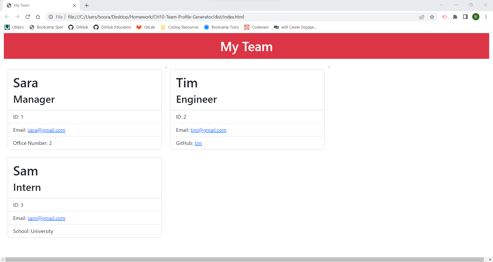

# CH10-Team-Profile-Generator
Objected-Oriented Programming Challenge

## Description

To build a Node.js command-line application that takes in information about employees on a software engineering team and generates an HTML webpage that displays summaries for each person.

## Installation

Use the following to run:
1. VS Code (or another code editor)
2. Install Node.js
3. Terminal (Command-line)
4. Install npm i inquerer@8.2.4
5. Install npm i jest

## Usage

Walkthrough video may be viewed here: 
https://drive.google.com/file/d/1XTuZC1r2Ojng_ZrcjWa3x6puND-G-dol/view?usp=sharing


Screenshot of rendered HTML:


    

## License

MIT Licesne Copyright (c) 2023 bjschoffman

## Tests

To run the test in the terminal enter: ```npm test```